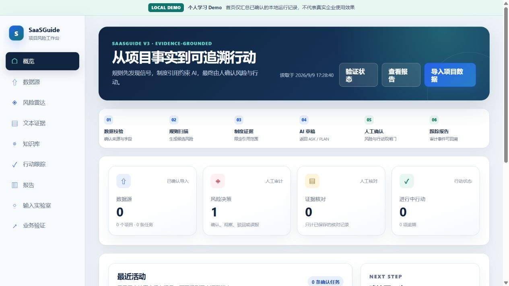
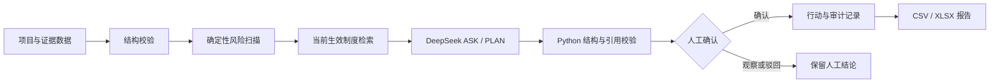
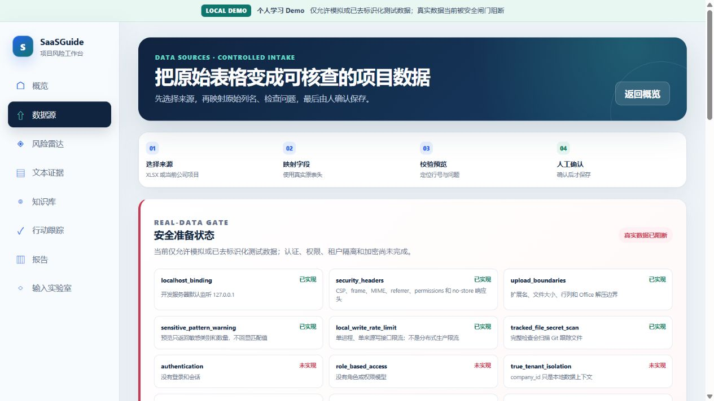
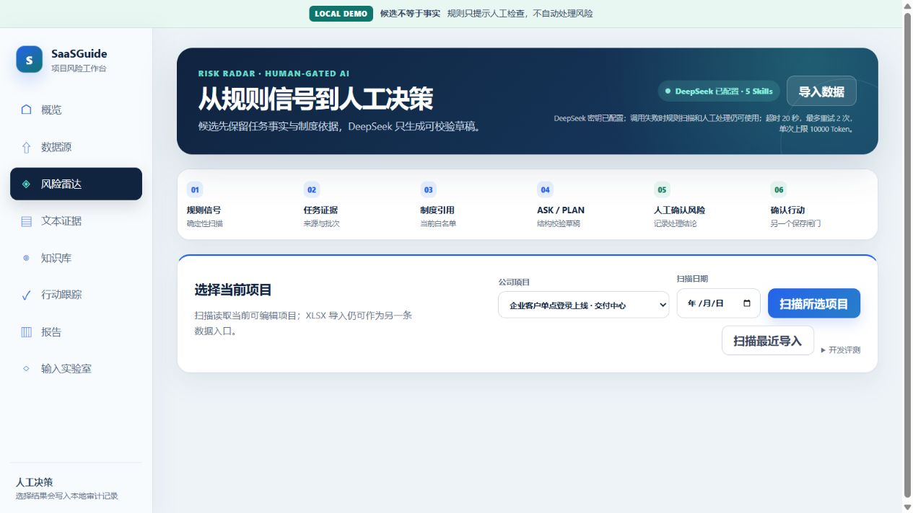

# SaaSGuide V3

SaaSGuide 是一个本地运行的项目风险助手。它把项目数据校验、确定性风险扫描、制度引用、DeepSeek 建议和人工确认放进同一条可追溯流程，最后从已确认记录生成行动与报告。

当前版本使用 6 家虚构公司和模拟项目数据，用于展示 AI 应用设计与工程实现。它没有真实客户、企业采用记录或业务效果数据，也没有公开部署。



## 三分钟体验

1. 按[本地运行](#本地运行)启动服务，打开 `http://127.0.0.1:4173/`；
2. 在“数据源”查看模拟公司与项目，在“风险雷达”运行规则扫描；
3. 打开候选风险，核对任务事实和制度依据；如已配置密钥，可请求 DeepSeek 返回 ASK 或 PLAN 草稿；
4. 人工确认风险和行动后，在“行动跟踪”和“报告”查看审计记录与汇总。

AI 只生成草稿。没有人工确认时，系统不会创建正式行动。

## 先看什么

- 想快速了解项目：继续阅读本页，然后看[HR 项目讲解稿](docs/portfolio/HR_PROJECT_EXPLAINER.md)和[案例说明](docs/portfolio/CASE_STUDY.md)。
- 想看产品设计：阅读[产品需求文档](docs/product/PRD.md)和[功能说明](docs/product/FEATURE_GUIDE.md)。
- 想看 AI 怎么运行：阅读[Agent 工作流](docs/architecture/AI_AGENT_WORKFLOW.md)。
- 想从文件开始理解代码：阅读[V2 源码学习指南](SOURCE_CODE_STUDY_GUIDE.md)。
- 想验证代码：按“本地运行”启动，再执行 `run_checks.ps1`。
- 想核对完成情况：查看[证据索引](docs/portfolio/EVIDENCE_INDEX.md)。

完整文档入口见 [docs/README.md](docs/README.md)。

## 从 V1 到 V3

| 版本 | 重点 | 当前定位 |
|---|---|---|
| V1 | 静态风险看板和基础 DeepSeek 演示 | 历史原型，材料保存在 `docs/history/v1/` |
| V2 | 数据接入、规则、知识、行动审计、报告和单 Orchestrator | 已完成并保留完整阶段证据记录 |
| V3 | 信息架构、业务闭环、评测、可靠性、检索、工程、安全、飞书连接器和试点验证工具 | 当前开发线；阶段 1–10 已形成分阶段证据，阶段 11 待真实参与者 |

## 当前文件地图

| 要找的内容 | 入口 |
|---|---|
| 产品现状与边界 | [当前状态](docs/PROJECT_STATUS.md)、[已知限制](docs/quality/KNOWN_LIMITATIONS.md) |
| 产品与操作 | [PRD](docs/product/PRD.md)、[用户手册](docs/product/USER_GUIDE.md) |
| 架构与 AI 流程 | [系统架构](docs/architecture/SYSTEM_ARCHITECTURE.md)、[AI 工作流](docs/architecture/AI_AGENT_WORKFLOW.md) |
| 测试与证据 | [测试策略](docs/quality/TEST_STRATEGY.md)、[证据索引](docs/portfolio/EVIDENCE_INDEX.md) |
| V3 规格和验收 | `docs/specs/`、`docs/test_records/` |
| 历史材料 | `docs/history/v1/`、`docs/history/handoffs/` |

## 它解决什么问题

项目数据常常散落在表格、周报和制度文档里。直接把这些内容交给大模型，会遇到三个问题：

1. 模型不知道哪些信息是事实、哪些只是待确认描述；
2. 模型可能引用不存在或已经失效的制度；
3. 建议如果直接写入正式任务，会越过人的判断。

SaaSGuide 的处理方式是：先用程序整理数据和发现候选风险，再让模型在受控上下文中给出 ASK 或 PLAN，最后由人决定是否记录行动。



## 当前功能

| 模块 | 当前实现 |
|---|---|
| 公司与项目 | 6 家差异化模拟公司；项目、任务、制度和风险标准按当前公司切换 |
| 数据接入 | XLSX 字段映射、校验、预览和确认保存；TXT、Markdown、DOCX、普通 PDF 解析 |
| 风险扫描 | 逾期、临期低进度、阻塞和直接依赖规则；候选去重并保留来源证据 |
| AI 研判 | 单 Orchestrator 调用当前知识上下文，DeepSeek 返回 ASK 或带引用 PLAN |
| 输出校验 | Python 检查 JSON 结构、引用白名单、行动数量、步骤顺序、负责人角色和完成信号 |
| 人工决策 | 确认、观察、驳回或标记误报；AI 不自动修改正式状态和期限 |
| 行动与报告 | SQLite 行动状态和事件审计；Python 计算指标并导出 CSV/XLSX |
| 固定评测 | 30 个跨公司合成项目，按公司、行业、项目类型和风险类型查看 TP/FP/FN |
| 知识检索 | 句子边界分块、关键词与本地稀疏词频向量混合排序、版本冲突拒答和精确位置引用 |
| 安全治理 | 敏感样式提示、Office 压缩边界、进程内限流和真实数据阻断状态；不等于生产安全 |
| 飞书连接器 | 多维表格读同步与人工确认写回已在真实租户端到端验证；写回默认关闭，只写入独立行动表，不修改客户原表 |
| 业务验证 | 固定一个风险到行动子场景，提供研究协议、去标识化证据校验和描述性分析；真实访谈尚未开展 |



## AI 和 Agent 在哪里

当前只有一个自管 Orchestrator，不是多 Agent 系统，也没有使用 OpenAI Agents SDK。

项目中定义了五个领域 Skill 合约：

- `project-data-intake`：接收并校验项目数据；
- `risk-signal-scan`：生成可解释的候选风险；
- `evidence-grounded-assessment`：检索当前生效制度并限制可引用范围；
- `risk-action-planner`：让 DeepSeek 返回 ASK 或 PLAN；
- `weekly-risk-report`：从确认后的本地记录生成报告。

一次风险卡 AI 调用实际运行中间三个 Skill。数据接入发生在上游，周报仍由确定性 Python 生成。详情见 [AI Agent 工作流](docs/architecture/AI_AGENT_WORKFLOW.md)。



## 本地运行

当前验证环境为 Windows、Python 3.11+ 和 Node.js。

```powershell
python -m venv .venv
& '.\.venv\Scripts\python.exe' -m pip install -r requirements.txt
& '.\start_v2.ps1'
```

浏览器打开 `http://127.0.0.1:4173/`。

不配置模型密钥时，数据管理、确定性扫描、知识检索、人工记录、报告和固定评测仍可运行。需要调用 DeepSeek 时：

```powershell
$env:DEEPSEEK_API_KEY = '你的密钥'
& '.\start_v2.ps1'
```

密钥不要写入 `.env.example`、源码或 Git 提交。

飞书多维表格读取需要在本机设置 `FEISHU_APP_ID`、`FEISHU_APP_SECRET`、`FEISHU_BITABLE_APP_TOKEN` 和 `FEISHU_BITABLE_TABLE_ID`。写回还必须显式设置独立的 `FEISHU_BITABLE_WRITEBACK_TABLE_ID` 并开启 `FEISHU_BITABLE_WRITEBACK_ENABLED`；读写表相同时程序会拒绝写回。配置示例见 `.env.example`。当前安全闸门只允许模拟或已去标识化测试表格。

主要页面：

- `/`：本地确认记录概览；
- `/data-sources`：公司、项目和 XLSX 数据；
- `/risk-radar`：规则扫描、DeepSeek 研判和开发评测；
- `/evidence-intake`：文本证据接入；
- `/knowledge-base`：版本化制度检索；
- `/action-tracker`：人工确认后的行动；
- `/reports`：本地指标和导出；
- `/input-lab`：PDF、WAV 与适配器边界实验；
- `/validation`：查看真实业务试点的外部证据状态。

具体操作见 [用户手册](docs/product/USER_GUIDE.md)。

## 验证

```powershell
& '.\run_checks.ps1'
```

截至 2026-09-16：

- 217 项自动测试通过；
- JSON、Markdown 链接、Git 跟踪文件密钥扫描和前端 JavaScript 语法检查通过；
- GitHub Actions 已在 Windows/Linux、Python 3.11/3.12 四项矩阵中真实通过；
- 主要页面完成桌面和 390 × 844 响应式验收；
- 真实 DeepSeek 浏览器验收取得两次 ASK 和一次合法 PLAN；
- 跨公司固定规则基准：TP=119、FP=4、FN=18、Precision=96.75%、Recall=86.86%。

最后一组数字只适用于作者构造并标注的合成场景，不是企业准确率，也不能证明 DeepSeek 的泛化能力。评测方法见 [评测说明](docs/quality/EVALUATION_REPORT.md)。

## 技术组成

- 前端：HTML、CSS、原生 JavaScript；
- 服务端：Python、Flask；
- 本地数据：JSON、SQLite；
- 文档与表格：python-docx、pypdf、openpyxl；
- 模型：DeepSeek API；
- 测试：Python unittest、数据校验、Node.js 语法检查、浏览器验收。

系统结构见 [SYSTEM_ARCHITECTURE.md](docs/architecture/SYSTEM_ARCHITECTURE.md)。

## 明确没有做的事

- 没有账号、RBAC、多人协作、生产级租户隔离或数据库加密；
- 没有公开部署、TLS、生产 WSGI、分布式限流或负载测试；
- 没有真实企业数据、真实客户采用或业务收益；
- 没有训练或微调 DeepSeek；
- 没有 Embedding 模型、向量数据库、多 Agent、真实 OCR 或语音识别；飞书仅以作者自建演示数据完成单租户真实链路验收，未验证生产负载；
- AI 输出是草稿，不能自动创建正式风险或替人确认行动。

完整边界见 [KNOWN_LIMITATIONS.md](docs/quality/KNOWN_LIMITATIONS.md) 和 [SECURITY.md](SECURITY.md)。

## 项目状态

当前版本按“本地单用户 AI 应用作品集”范围完成。代码已推送到私有 GitHub 仓库，并创建 `v3.0.0-portfolio` Pre-release；尚未公开仓库或部署公网 Demo。

- 当前实现：[docs/PROJECT_STATUS.md](docs/PROJECT_STATUS.md)
- 产品路线：[docs/V2_ROADMAP.md](docs/V2_ROADMAP.md)
- 发布检查：[docs/portfolio/RELEASE_CHECKLIST.md](docs/portfolio/RELEASE_CHECKLIST.md)
- V3 发布说明：[docs/portfolio/RELEASE_NOTES_V3.md](docs/portfolio/RELEASE_NOTES_V3.md)
- 演示路线：[docs/portfolio/DEMO_GUIDE.md](docs/portfolio/DEMO_GUIDE.md)
- 变更记录：[CHANGELOG.md](CHANGELOG.md)

## License

[MIT License](LICENSE)
