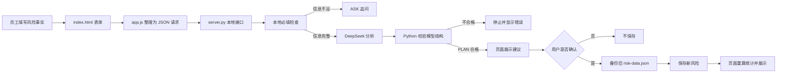

# SaaSGuide 源码、底层逻辑与能力迁移说明书

## 0. 先说结论：你真正需要学什么

你不需要背下 600 多行 JavaScript 或手写整套 CSS。你需要掌握的是下面这条可以反复迁移的工作链：

```text
把业务问题说清楚
→ 把信息整理成固定字段
→ 让页面收集和展示字段
→ 让程序执行确定规则
→ 把适合语言理解的部分交给模型
→ 校验模型结果
→ 人工确认高影响动作
→ 保存、测试并记录边界
```

这条链不仅适用于风险看板，也可以迁移到跨境电商的广告复盘、库存预警、Listing 检查、评价归类和运营日报。

---

## 1. 项目的完整结构

```text
SaaSGuide/
├─ PROJECT_BRIEF.md              项目范围与真实性边界
├─ README.md                     给第一次看到项目的人看的入口
├─ index.html                    风险看板有哪些区域
├─ styles.css                    页面区域如何排列和显示
├─ app.js                        页面读取数据、点击和状态变化
├─ risk-data.json                当前 5 条模拟风险
├─ guide-data.json               四步导览内容和目标映射
│
├─ server.py                     本地服务、接口、确认保存和备份
├─ deepseek_risk_assistant.py    主产品：风险 ASK / PLAN
├─ deepseek_ask_build.py         后台实验：引导 ASK / BUILD
├─ validate_data.py              JSON 和页面规则检查
├─ requirements.txt              Python 依赖，目前只有 Flask
│
├─ test_validator.py             数据校验测试
├─ test_deepseek_ask_build.py    引导生成测试
├─ test_risk_assistant.py        风险 AI 输出测试
├─ test_server.py                完整接口与保存测试
├─ run_checks.ps1                一键运行全部检查
│
├─ PHASE1_TEST_RECORD.md         静态页面阶段证据
├─ PHASE2_TEST_RECORD.md         JSON 数据阶段证据
├─ PHASE3_TEST_RECORD.md         Python 校验阶段证据
├─ PHASE4_TEST_RECORD.md         DeepSeek 阶段证据
├─ PHASE5_TEST_RECORD.md         Flask 串联阶段证据
├─ PHASE6_TEST_RECORD.md         异常与回归测试证据
├─ RISK_ASSISTANT_TEST_RECORD.md 风险助手真实调用证据
├─ NEW_RISK_WORKFLOW_TEST_RECORD.md 新建风险闭环证据
│
├─ DECISION_LOG.md               为什么做这些产品和技术选择
├─ BUG_LOG.md                    真实错误、原因和修复
├─ DEMO_SCRIPT.md                3 分钟演示顺序
├─ RESUME_EVIDENCE.md            能写和不能写进简历的内容
└─ generated/                    模型结果、运行记录和数据备份
```

### 这些文件为什么要分开

- 页面结构、外观、交互分开：修改颜色不会影响数据，修改数据不会重写页面结构。
- 确定规则与 AI 分开：日期是否合法由程序判断，不浪费模型费用；语言分析交给 DeepSeek。
- 产品代码与测试分开：测试可以故意制造错误，不污染真实模拟数据。
- 实现与证据分开：代码证明“做了什么”，测试记录证明“真的运行过什么”。

---

## 2. 整体运行关系



最关键的边界是：DeepSeek 的输出不会直接进入风险列表，中间必须经过“程序校验”和“用户确认”。

---

## 3. 前端第一层：`index.html` 放了什么

`index.html` 是页面骨架。它不负责计算，也不调用模型，只负责提供可以被程序找到的区域。

### 3.1 概览卡为什么有 `data-risk-count`

```html
<strong data-risk-count="all">0</strong>
<span data-risk-count="high">0</span>
```

形成原因：最初数量容易被写死。后来要求数量必须跟真实列表变化，所以页面只保留“数字应该放在哪里”的标记，真正的数字由 `app.js` 计算。

跨境迁移：同样可以把这些标记换成订单数、库存预警数、广告异常数，但计算口径必须先定义。

### 3.2 风险列表为什么只有空的 `tbody`

```html
<tbody id="risk-table-body"></tbody>
```

形成原因：风险行来自 JSON，不能在 HTML 中再维护一份重复数据。JavaScript 读取 `risk-data.json` 后生成每一行。

### 3.3 新建风险弹窗

```html
<form id="new-risk-form">
  <!-- 标题、描述、影响、责任人、截止日期、补充说明 -->
</form>
```

形成原因：普通员工的真实入口应该是“我发现了一个风险”，而不是先进入 AI 引导生成器。表单收集的是事实，不要求用户先判断等级。

### 3.4 AI 结果区为什么写 `aria-live`

```html
<div id="new-risk-result" aria-live="polite"></div>
```

作用：模型结果返回后，辅助阅读工具也能知道这里发生了变化。这属于 Accessibility（可访问性）意识。

源码入口：[index.html](/D:/CodexProjects/SaaSGuide/index.html:1)

---

## 4. 前端第二层：`styles.css` 如何决定外观

CSS 不处理业务规则，只处理视觉关系。

### 4.1 全局颜色变量

```css
:root {
  --brand: #6557e8;
  --danger: #dc3f57;
  --warning: #b86b0a;
  --success: #198865;
}
```

作用：高风险、警告、完成状态使用统一颜色。如果以后换品牌颜色，只改集中定义，不必搜遍整个文件。

### 4.2 等级样式与业务字段的对应

```css
.risk-level--high { /* 高风险 */ }
.risk-level--medium { /* 中风险 */ }
.risk-level--low { /* 低风险 */ }
```

关系：JSON 的 `type: "high"` 经过 JavaScript 拼成 `risk-level--high`，CSS 再决定它显示为红色。

### 4.3 Responsive Design（响应式设计）

```css
@media (max-width: 700px) {
  .workspace-grid { grid-template-columns: 1fr; }
  .new-risk-form__grid { grid-template-columns: 1fr; }
}
```

形成原因：电脑上适合左右排列，手机上继续左右排列会挤压和溢出，因此小屏改为上下排列。

你要掌握的是“布局为什么要变化”，不需要背每个像素值。

源码入口：[styles.css](/D:/CodexProjects/SaaSGuide/styles.css:1)

---

## 5. 前端核心：`app.js` 每个代码块的作用

### 5.1 State（状态）

```javascript
let initialRiskData = [];
let riskData = [];
let selectedRiskId = "api-delay";
let latestNewRiskAnalysis = null;
```

- `initialRiskData`：页面刚加载时的副本，用于恢复演示。
- `riskData`：当前页面正在使用的风险列表。
- `selectedRiskId`：当前右侧详情对应哪条风险。
- `latestNewRiskAnalysis`：最近一次可等待确认的 AI 方案。

形成原因：页面不是一张静态图片，它要记住“当前数据、当前选择、当前 AI 结果”。

跨境迁移：可以对应当前商品列表、选中的 SKU、当前广告筛选和最近一次 AI 建议。

### 5.2 从 JSON 读取数据

```javascript
async function loadRiskData() {
  const response = await fetch("risk-data.json");
  const data = await response.json();
  initialRiskData = cloneRisks(data.risks);
  riskData = cloneRisks(initialRiskData);
}
```

关系：`risk-data.json` 是输入，`loadRiskData()` 把它变成页面内存中的数组，后面的渲染、统计和筛选都使用这个数组。

### 5.3 渲染风险行

```javascript
function renderRiskRows() {
  tableBody.innerHTML = riskData.map((risk) => `...`).join("");
}
```

`map` 的含义：把每一个风险对象转换成一行 HTML。5 个风险对象就生成 5 行。

代码中同时使用 `escapeHtml()`，防止数据中的特殊字符被浏览器错误理解成页面代码。

### 5.4 动态统计

```javascript
function updateRiskCounts() {
  const counts = { all: 0, high: 0, medium: 0, low: 0 };
  riskData.forEach((risk) => {
    counts.all += 1;
    if (risk.type in counts) counts[risk.type] += 1;
  });
}
```

形成原因：中风险数量缺失以及固定数字会随新增数据失真，所以统计改为遍历当前列表重新计算。

跨境迁移：逻辑结构与“遍历广告记录，累计点击、花费、订单”相同，但 CTR、CVR、ACOS、ROAS 的公式还没有在本项目实现。

### 5.5 筛选和详情

```javascript
const isVisible = filter === "all" || row.dataset.risk === filter;
row.classList.toggle("is-hidden", !isVisible);
```

筛选不会删除数据，只改变哪些行可见。点击行后，`showRiskDetail()` 根据 ID 从 `riskData` 找到对应对象，再更新右侧详情。

### 5.6 已有风险的 AI 分析

```javascript
fetch("/api/risks/analyze", {
  method: "POST",
  headers: { "Content-Type": "application/json" },
  body: JSON.stringify({ risk: selectedRisk, contextNote })
});
```

这里完成了 HTTP Request（网络请求）：浏览器只发送风险资料，不发送 API 密钥。密钥留在 Python 服务中。

### 5.7 新建风险的防误操作机制

```javascript
if (!latestNewRiskAnalysis ||
    latestNewRiskFingerprint !== newRiskFingerprint(draft)) {
  renderNewRiskError("填写内容已经变化，请重新进行 AI 分析后再确认。");
  return;
}
```

形成原因：如果用户在 AI 分析后修改了事实，旧建议可能已经不适用。Fingerprint（内容指纹）用于确认“现在保存的输入”和“刚才分析的输入”仍是同一份。

### 5.8 人工确认后保存

```javascript
fetch("/api/risks", {
  method: "POST",
  body: JSON.stringify({ draft, analysis: latestNewRiskAnalysis })
});
```

只有这个请求会要求服务器写入 `risk-data.json`。分析请求本身不会新增风险。

### 5.9 CSV 导出

```javascript
const csv = [headers, ...rows]
  .map((row) => row.map(csvCell).join(","))
  .join("\r\n");
```

作用：把对象数组转换成表格行。UTF-8 BOM 用于减少中文在 Excel 中乱码的概率。

源码入口：[app.js](/D:/CodexProjects/SaaSGuide/app.js:1)

---

## 6. 数据层：两个 JSON 为什么不同

### 6.1 `risk-data.json`

一条风险的核心结构：

```json
{
  "id": "api-delay",
  "type": "high",
  "level": "高风险",
  "title": "第三方 API 联调延迟",
  "owner": "周航",
  "due": "2026-09-02",
  "impact": "支付与消息模块",
  "status": "待处理",
  "plan": ["申请供应商专属联调环境"]
}
```

这叫 Data Model（数据模型）：程序事先约定每条风险有哪些字段、字段代表什么。

跨境迁移示例：一条商品数据也可以约定 `sku`、`sales`、`adSpend`、`orders`、`stock`、`leadTimeDays`。字段清楚后，程序才可能稳定计算。

### 6.2 `guide-data.json`

```json
{
  "step": 2,
  "target": "highRiskFilter",
  "action": "filter-high"
}
```

它不保存风险，而是保存“第几步、指向哪里、进入时做什么”。形成原因是让引导文案与页面程序分离。

源码入口：[risk-data.json](/D:/CodexProjects/SaaSGuide/risk-data.json:1)、[guide-data.json](/D:/CodexProjects/SaaSGuide/guide-data.json:1)

---

## 7. 后端：`server.py` 为什么必须存在

浏览器不能安全保存 DeepSeek 密钥，也不应该直接随意写电脑文件。因此加入本地 Flask 服务作为中间层。

### 7.1 三个主要接口

```text
GET  /                   返回风险看板
POST /api/risks/analyze  分析风险，只返回 ASK 或 PLAN
POST /api/risks          确认后保存新风险
```

后台学习实验另外使用 `POST /api/guides/generate`。

### 7.2 确认后的风险不是直接照抄 AI

```python
def build_confirmed_risk(draft, analysis):
    if analysis.get("decision") != "PLAN":
        raise ValueError("只有通过校验的 PLAN 才能加入风险列表")
```

服务器重新检查 PLAN，并自己生成 ID、计算是否逾期、固定初始状态为“待处理”。这是 Server-side Validation（服务器端校验），不能只相信前端按钮。

### 7.3 为什么使用锁

```python
RISK_WRITE_LOCK = threading.Lock()

with RISK_WRITE_LOCK:
    # 读取、校验、备份、写入
```

作用：避免同一个本地进程中的两个保存动作同时改文件。不过它不是完整的多用户并发方案，因此仍不能称为生产级系统。

### 7.4 为什么先备份再写入

```python
backup_dir / "risk-data.<时间>.backup.json"
```

形成原因：JSON 文件没有数据库事务和版本历史。备份至少允许找回修改前状态。

### 7.5 Atomic Write（原子写入）

```python
temporary.write_text(content, encoding="utf-8")
temporary.replace(path)
```

不是直接一点点覆盖正式文件，而是先写临时文件，完成后整体替换，降低写到一半留下残缺 JSON 的风险。

源码入口：[server.py](/D:/CodexProjects/SaaSGuide/server.py:1)

---

## 8. AI 层：DeepSeek 到底负责什么

### 8.1 主产品：`deepseek_risk_assistant.py`

DeepSeek负责：

- 理解自然语言风险描述。
- 判断还缺哪些语义信息。
- 给出建议等级和优先级。
- 把建议整理成行动步骤和完成信号。

DeepSeek不负责：

- 读取或保存 API 密钥以外的项目文件。
- 自动把风险标记为完成。
- 绕过人工确认。
- 证明风险真实发生或建议一定正确。

### 8.2 Local Precheck（本地预检查）

```python
missing = find_missing_risk_fields(risk)
if missing:
    return make_local_ask(missing)
```

明显缺字段时直接 ASK，不调用模型。形成原因是确定规则用程序更便宜、更快、更稳定。

### 8.3 Structured Output（结构化输出）

PLAN 必须包含：

```json
{
  "decision": "PLAN",
  "summary": "...",
  "suggestedLevel": "高风险",
  "priority": "立即处理",
  "rationale": ["..."],
  "actions": [
    {"step": 1, "action": "...", "successSignal": "..."}
  ],
  "cautions": ["..."]
}
```

形成原因：如果模型只返回一段自由文本，页面不知道哪一句是等级、哪一句是行动，也很难自动检查。

### 8.4 后台实验：`deepseek_ask_build.py`

它验证了另一种工作流：功能 Brief 信息不足时 ASK，信息充分时 BUILD 引导步骤。后来产品判断认为普通员工并不需要先生成引导，因此它被降为 `/builder` 后台学习证据。

这次调整体现的不是代码能力，而是 Product Judgment（产品判断）：能做不代表应该放在主流程。

源码入口：[deepseek_risk_assistant.py](/D:/CodexProjects/SaaSGuide/deepseek_risk_assistant.py:1)、[deepseek_ask_build.py](/D:/CodexProjects/SaaSGuide/deepseek_ask_build.py:1)

---

## 9. Validation（校验）层：`validate_data.py`

它负责检查：

- 必填字段是否存在。
- 字段类型是否正确。
- 高、中、低风险的英文类型与中文等级是否匹配。
- 日期是否为合法日期。
- 风险 ID 是否重复。
- 应对计划是否为空。
- 导览步骤是否从 1 连续排列。
- 导览目标是否真的存在于 `index.html`。

关系：

```text
JSON 数据 ─┐
           ├→ validate_data.py → 通过或错误清单
index.html ─┘
```

AI 的语言建议由 `deepseek_risk_assistant.py` 校验，完整风险文件由 `validate_data.py` 校验。这是两层不同对象的检查。

跨境迁移：可以校验 SKU 不为空、货币代码合法、广告花费非负、日期范围正确、库存字段没有缺失。业务规则必须由运营人员参与定义。

源码入口：[validate_data.py](/D:/CodexProjects/SaaSGuide/validate_data.py:1)

---

## 10. 测试层：38 项测试证明了什么

```text
test_validator.py          数据规则是否能拦错
test_deepseek_ask_build.py 模型输出规则是否稳定
test_risk_assistant.py     ASK / PLAN 是否符合约定
test_server.py             页面、接口、保存和失败路径能否串起来
```

Fake Client（模拟客户端）的作用：自动测试时不真的消耗 DeepSeek 费用，而是提供预先准备好的正确或错误返回。

已覆盖：

- 缺字段、非法 JSON、重复步骤和不存在目标。
- 缺密钥、非法等级、非法优先级和行动步骤跳号。
- ASK 不能保存、非法日期不能保存。
- 请求过大、保存路径不可用、数据文件缺失。
- 合法低风险可以保存并生成备份。

没有证明：

- 高并发、大规模数据性能。
- 恶意攻击下的完整安全性。
- DeepSeek 长期每次都给出高质量建议。
- 真实企业环境稳定运行。

一键运行：[run_checks.ps1](/D:/CodexProjects/SaaSGuide/run_checks.ps1:1)

---

## 11. 一条新风险实际经过了什么

以“测试环境证书即将过期”为例：

1. 表单把标题、描述、影响、责任人和日期交给 `app.js`。
2. `app.js` 生成临时风险对象并请求 `/api/risks/analyze`。
3. `server.py` 调用 `deepseek_risk_assistant.py`。
4. 本地预检查确认字段齐全，才调用 DeepSeek。
5. DeepSeek 返回高风险、立即处理、3 条行动。
6. Python 检查等级、优先级、步骤编号和完成信号。
7. 页面展示 PLAN，此时列表仍为 4 条。
8. 用户确认后，页面请求 `/api/risks`。
9. 服务器重新校验、生成 ID、固定待处理状态、备份旧文件。
10. `risk-data.json` 增加到 5 条，页面重新渲染和统计。
11. 刷新后仍为 5 条，证明不是仅存在浏览器内存。

---

## 12. 你应该掌握的能力等级

### A. 必须能够独立解释

- 项目解决什么问题，目标用户是谁。
- 输入、处理、输出分别是什么。
- JSON、页面、Python 服务和 DeepSeek 的分工。
- ASK 与 PLAN 的区别。
- 为什么 AI 之后还要校验和人工确认。
- 为什么本项目只能称为个人学习 Demo。

### B. 必须能够独立操作

- 在项目文件夹打开 PowerShell。
- 启动 `server.py` 并打开网页。
- 新建一条模拟风险并解释统计变化。
- 运行 `run_checks.ps1`，知道 `OK` 表示什么。
- 在 `risk-data.json` 找到刚保存的数据。

### C. 建议能够完成的小修改

- 修改一条风险的责任人或日期。
- 增加一个新的风险字段，并同步修改页面和校验。
- 给测试增加一个错误样例。
- 修改导出 CSV 的列顺序。

这几项比从空白手写整个项目更接近工作中的实际能力。

### D. 当前项目没有证明的能力

- Python/Pandas 处理真实运营数据。
- SQL 查询。
- Amazon、Ozon、TikTok Shop 等平台后台实操。
- CTR、CVR、ACOS、ROAS、库存周转等指标分析。
- Listing SEO、广告调价、补货决策和平台合规判断。
- RAG、向量数据库、模型训练或微调。

不要把“概念上可以迁移”说成“已经具备真实经验”。

---

## 13. 可以迁移到跨境电商运营的能力

| SaaSGuide 已做能力 | 跨境运营中的可迁移场景 | 当前是否已经证明 |
|---|---|---|
| 需求拆解 | 把“销量下降”拆成流量、转化、价格、库存和评价问题 | 已证明拆解流程；未证明真实运营判断 |
| JSON 数据模型 | 统一 SKU、站点、销售、广告、库存和成本字段 | 已证明结构化思维；未处理真实平台数据 |
| 动态统计 | 根据当前列表自动重算风险数 | 已证明基础统计；未实现 CTR/CVR/ACOS/ROAS |
| 筛选与详情 | 按站点、SKU、异常等级筛选商品或广告 | 已证明交互模式；未接平台数据 |
| AI 结构化输出 | 评价归类、Listing 检查、日报解释、异常建议 | 已证明 API 与结构校验；业务 Prompt 仍需另做 |
| 人工确认 | 调价、停广告、改 Listing、补货前人工批准 | 已证明确认机制；未连接平台执行 |
| Validation | 拦截缺失 SKU、非法日期、负数花费和异常字段 | 已证明校验方法；规则需按业务重新定义 |
| 备份与日志 | 保留调价、Listing 修改和日报生成记录 | 已证明本地记录意识；未做企业审计 |
| 异常测试 | API 失败、文件缺失时不继续错误操作 | 已证明主要失败分支测试 |
| 响应式页面 | 制作可在电脑和手机查看的运营工具 | 已完成本地页面验收 |

最值得复用的是“数据 → 规则 → AI 解释 → 人工确认 → 记录”的闭环，而不是风险看板的紫色界面。

---

## 14. 下一项目如何直接迁移到跨境运营

最合适的补充项目不是再做一个聊天框，而是：

```text
模拟广告、订单、库存 CSV
→ Python/Pandas 清洗
→ 计算 CTR、CVR、ACOS、ROAS、库存可售天数
→ 规则识别异常
→ DeepSeek 解释异常和建议动作
→ 人工确认
→ 导出运营日报
```

这里可以直接复用：

- Flask 接口结构。
- ASK / PLAN 输出模式。
- Python 校验方式。
- 人工确认机制。
- 测试组织方式。
- CSV 导出和响应式页面。

需要新增学习：

- Pandas 与 CSV 清洗。
- 跨境广告和库存指标公式。
- 货币、时区、站点和 SKU 口径。
- 平台政策和运营动作的业务限制。

---

## 15. 你可以怎样向面试官讲底层逻辑

“我先把虚构项目风险整理成固定 JSON 字段，前端根据当前列表动态生成表格和统计。用户提交风险后，Flask 服务先检查必填信息，完整时才调用 DeepSeek。模型必须返回 ASK 或 PLAN 的固定结构，Python 再检查等级、步骤和完成信号。AI 建议不会直接保存，用户确认后服务器才备份旧数据并原子写入 JSON。项目用 38 项自动测试和桌面、手机浏览器验收覆盖了主要正常与异常路径。它是模拟数据的个人学习 Demo，不是生产系统。”

如果你能不看逐字稿说明上面这段，并独立完成一次新建风险演示，就已经掌握了这个项目最有价值的部分。

