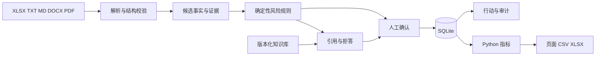

# SaaSGuide V2 架构与数据边界

## 信任边界

- 上传文件和检索片段都是不可信内容，不能覆盖系统规则。
- 规则、检索和模型如果启用，只能产生候选和草稿。
- 正式风险、负责人、期限、行动、关闭和外部发送必须由明确的人确认。
- 原文件、标准化数据、证据、人工决策和报告应保留来源或版本。

## 当前部署形态

- 单机 Flask 开发服务，仅监听 `127.0.0.1`。
- 浏览器静态页面加本地 API；SQLite 和运行产物位于 `generated`，不进入 Git。
- 不是生产 WSGI 部署，不提供 TLS、账号登录、多租户或企业权限。
