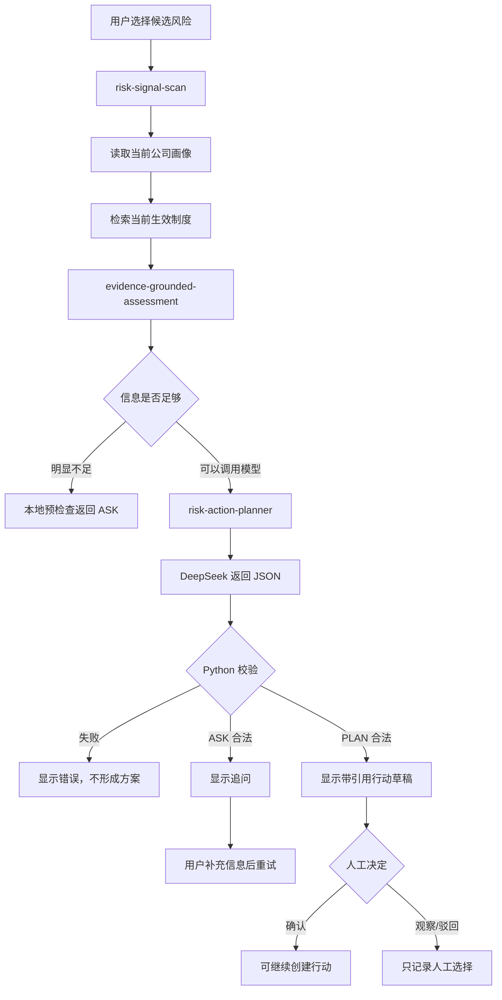

# AI Agent 工作流

## 先说明名称

项目里的 Agent 是一个由 Python 管理的 Orchestrator。它按固定顺序调用已有工具，并在调用 DeepSeek 前后执行约束。它不是多个模型互相协作，也不是一个可以自由操作系统的通用 Agent。

Skill 在这里指领域步骤的运行合约：每一步规定需要什么输入、产生什么输出、什么情况必须停止。它们不是安装在 Codex 客户端里的 Skill 包。

## 五个 Skill 合约

| Skill | 输入 | 输出 | 当前运行位置 |
|---|---|---|---|
| `project-data-intake` | XLSX 或可编辑项目 | 统一项目数据和来源 | AI 调用上游 |
| `risk-signal-scan` | 项目任务、公司阈值 | 候选风险和证据 | 每次风险扫描 |
| `evidence-grounded-assessment` | 候选、公司画像、有效制度 | 允许引用的上下文 | AI 调用前 |
| `risk-action-planner` | 候选、补充信息、允许引用 | ASK 或 PLAN | DeepSeek 调用 |
| `weekly-risk-report` | 已确认记录和行动 | 指标、CSV、XLSX | 独立确定性流程 |

## 一次 AI 研判

## ASK 和 PLAN

### ASK

当影响、责任、时间、依赖或证据不足时，系统应当先追问。明显缺字段由本地预检查拦截，避免无意义的模型费用；更复杂的信息不足由 DeepSeek 返回 ASK。

### PLAN

合法 PLAN 必须包含：

- 风险建议等级和处理优先级；
- 简短摘要和判断依据；
- 1–3 条连续行动；
- 每条行动的负责人角色和完成信号；
- 只来自当前白名单的制度引用；
- 注意事项。

PLAN 仍是草稿。它不会直接修改风险、任务或行动数据库。

## 模型前后的程序约束

### 调用前

- 只读取当前公司；
- 只检索当前生效制度；
- 把可引用文档编号组成白名单；
- 对明显缺失信息先返回 ASK；
- 不把 API 密钥放进浏览器。

### 调用后

- 必须是合法 JSON；
- `decision` 只能是 ASK 或 PLAN；
- PLAN 字段不能缺失；
- 引用必须存在于白名单；
- 行动不能超过三条；
- 步骤编号必须连续；
- 每条行动必须包含负责人角色和完成信号。

这些检查降低了结构失控和伪造引用的风险，但不能证明建议在业务上一定正确。

## 为什么没有做多 Agent

当前任务链是线性的，风险扫描和知识检索已经有确定性工具。拆成多个自治 Agent 会增加状态同步、调试、费用和责任边界，而不会自动提高结果质量。因此当前选择单 Orchestrator：模型只负责需要语言理解的风险研判，其他步骤保留可测试的 Python 实现。

## 运行证据

- 自动测试覆盖合法 ASK、合法 PLAN、非法 JSON、伪造引用、行动过多和缺字段；
- 浏览器真实调用得到两次递进 ASK 和一次合法 PLAN；
- PLAN 使用三条允许引用和三条连续行动；
- 验收没有点击人工确认，因此没有自动形成正式行动。

详细记录见 [V2_AI_ORCHESTRATION_TEST_RECORD_2026-09-05.md](../test_records/V2_AI_ORCHESTRATION_TEST_RECORD_2026-09-05.md)。
