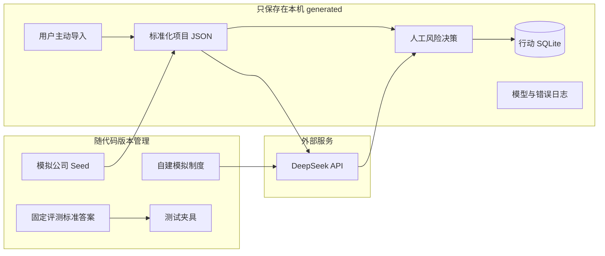

# 数据与信任边界

## 数据从哪里来

版本化模拟数据用于复现功能；运行数据用于记录当前用户操作。两者不能混为一类，首页只统计确认后的运行记录。

## 信任等级

| 数据 | 处理方式 | 不能做什么 |
|---|---|---|
| 上传文件 | 限制大小和类型，解析后校验 | 文件内容不能改变程序规则 |
| 文本证据 | 保留原文位置，等待人工核对 | 未核对候选不能直接当事实 |
| 公司制度 | 按公司、版本、生效日期检索 | 过期或其他公司的制度不能进入引用白名单 |
| 模型输出 | Python 校验结构和引用 | 不能直接创建正式行动或修改状态 |
| 固定标准答案 | 版本化并与 Seed 对齐 | 不能当作独立专家或真实企业标注 |
| 人工选择 | 记录选择和时间 | 不代表所有输入事实已经外部验证 |

## Git 边界

允许进入 Git：

- 源码；
- 虚构 Seed；
- 自建制度和测试夹具；
- 固定标准答案；
- 不含个人信息的截图和验收记录。

不允许进入 Git：

- `.env` 和 API 密钥；
- 用户真实导入；
- SQLite 运行数据库；
- 模型运行日志和错误日志；
- 备份文件；
- 个人简历和求职材料。

对应路径由 `.gitignore` 排除，但忽略规则不能替代发布前检查。

## 公司隔离的真实含义

公司、项目、任务、制度和模型上下文按 `company_id` 切换。这能验证上下文不会在模拟公司之间串用，但当前没有登录、权限或并发租户机制，所以不能称为生产多租户。

## DeepSeek 传输边界

真实模型调用会把当前候选风险、用户补充信息、模拟公司画像和允许引用的自建制度发送给 DeepSeek。当前验收只使用仓库内虚构内容。

如果以后接入真实企业数据，需要先解决：

- 去标识化；
- 数据最小化；
- 服务商数据政策和保存期限；
- 用户授权；
- 密钥、费用和速率限制；
- 审计和删除机制。
