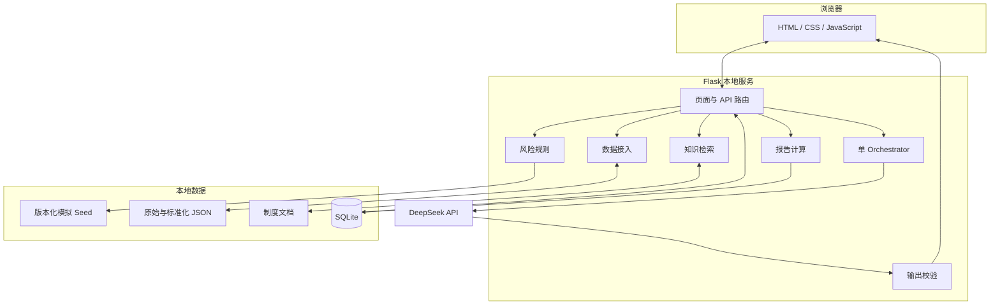
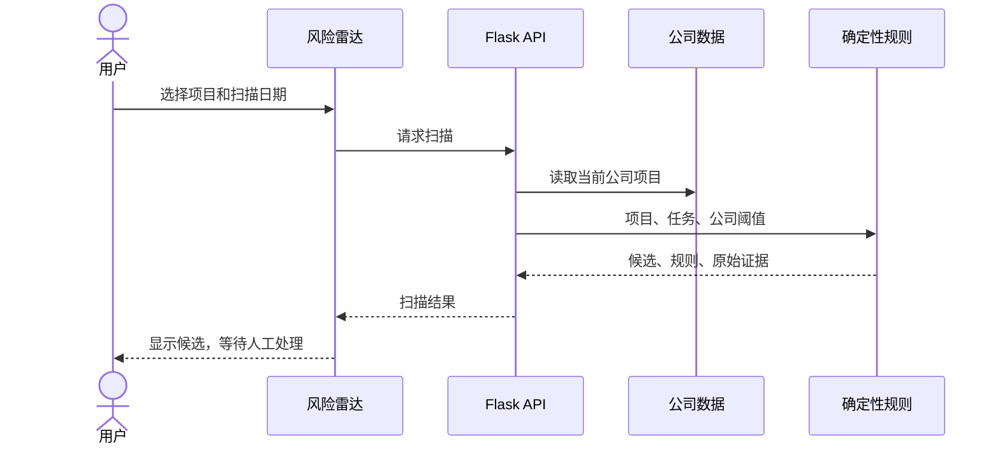
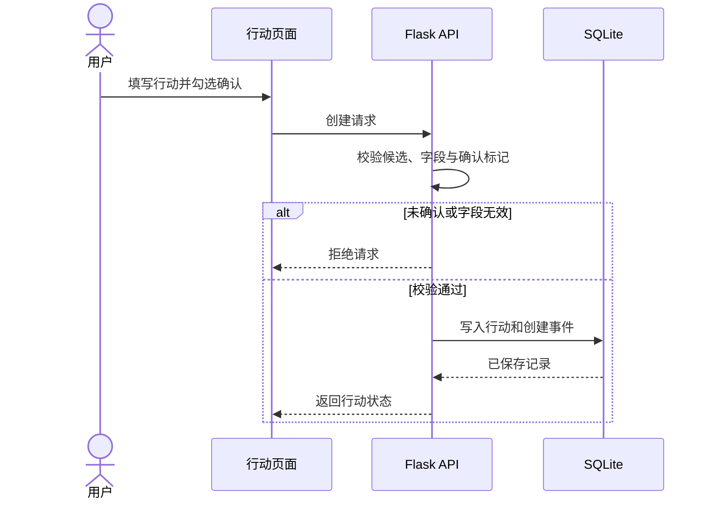

# 系统架构

## 总览

SaaSGuide 是浏览器页面加本地 Flask API 的单机应用。前端不持有模型密钥，用户运行数据保存在本地文件和 SQLite 中。

## 模块职责

| 模块 | 主要文件 | 职责 |
|---|---|---|
| Web 服务 | `server.py` | 路由、请求限制、错误映射、安全响应头和模块组装 |
| XLSX 接入 | `services/ingestion/xlsx_import.py` | 表头建议、映射、校验、预览和确认保存 |
| 文本证据 | `services/ingestion/text_evidence.py` | TXT、Markdown、DOCX 解析与来源位置 |
| PDF/WAV | `services/ingestion/pdf_audio.py` | 普通 PDF 文本、OCR 需求检测和 WAV 元数据 |
| 公司数据 | `services/company_data/store.py` | 多公司结构、迁移、CRUD 和当前公司上下文 |
| 风险规则 | `services/risk_rules/deterministic_scan.py` | 候选风险、证据、去重和人工决策记录 |
| 知识检索 | `services/retrieval/knowledge_base.py` | 生效版本检索、引用、冲突和拒答 |
| AI 编排 | `services/ai/orchestrator.py` | Skill 运行顺序、DeepSeek 调用准备和结果验证 |
| Skill 合约 | `services/ai/skills.py` | 五个领域步骤的输入、输出和边界描述 |
| 行动数据 | `database/store.py` | SQLite 迁移、行动状态机和事件审计 |
| 报告 | `services/reporting/metrics.py` | 指标、CSV 和 XLSX 输出 |
| 跨公司评测 | `services/evaluation/company_benchmark.py` | 固定标准答案、分组指标和错误案例 |

## 请求链路

### 项目扫描

### 行动记录

## 部署形态

- Flask 默认绑定 `127.0.0.1:4173`；
- 页面、API、JSON 和 SQLite 都在同一台电脑；
- 前端通过同源请求访问 API；
- DeepSeek 是唯一当前真实外部调用；
- `generated/` 保存运行数据但不进入 Git。

这种结构适合本地作品集和受控演示，不适合直接公开部署。
